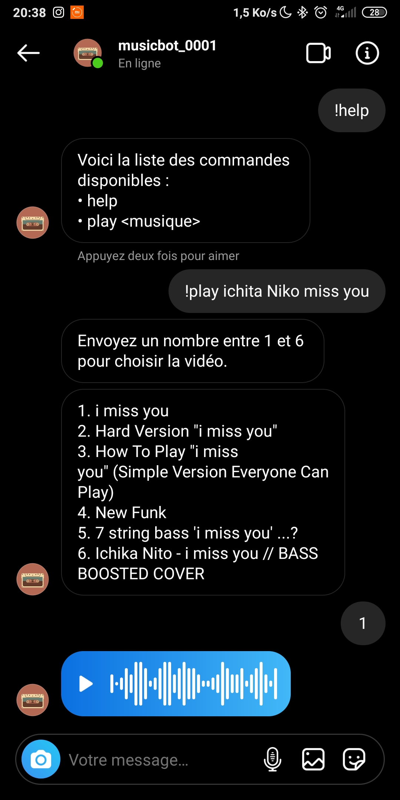

# Insta Music Bot

Simple instagram bot to send music or youtube videos (limited to those of one minute or less) by voice messages on instagram !

# How to use

Just send `!play musicname` to the bot in private message, make your choice among the proposed results and let's hear it!



# How to install

```
git clone https://github.com/SimonLeclere/Instagram-music-bot.git
npm i
```

Then fill the configuration file with your instagram credentials and use the following command to launch the bot.

```
node .
```

This little project uses [insta.js](https://github.com/Androz2091/insta.js) a module created by [Androz2091](https://github.com/Androz2091/) <3
